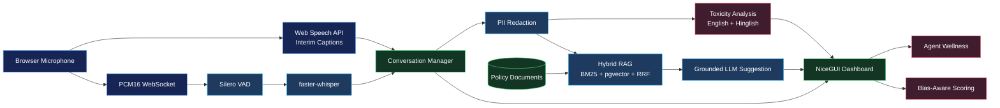

<div align="center">

# AgentShield

### Real-time AI support for safer, faster customer-service calls

Live speech transcription | Grounded RAG suggestions | Hinglish toxicity detection | Agent wellness

[](https://www.python.org/)
[](https://fastapi.tiangolo.com/)
[](https://www.postgresql.org/)
[](https://redis.io/)
[](https://www.docker.com/)
[](#project-status)

**[Architecture](#architecture) | [Features](#core-capabilities) | [Benchmarks](#model-evaluation--benchmarks) | [Setup](#setup) | [API](#api-reference)**

</div>

---

AgentShield is a portfolio project I built to explore how AI could support customer-service agents during difficult live calls. It transcribes speech, retrieves relevant policy documents, suggests grounded English or Hinglish responses, and tracks toxicity and agent wellness. The most interesting challenge was keeping several imperfect components, including browser speech recognition, VAD, retrieval, and generation, useful in one near-real-time workflow.

## Core Capabilities

| Live Call Intelligence | Grounded Assistance | Agent Safety |
| --- | --- | --- |
| Browser interim captions | BM25 + pgvector hybrid retrieval | English and Hinglish toxicity scoring |
| faster-whisper transcription | Source-grounded response generation | Real-time danger and escalation alerts |
| PCM16 WebSocket streaming | No-answer behavior when policy is missing | Shift-level wellness tracking |
| VAD and FFmpeg normalization | TXT, PDF, DOCX, and HTML ingestion | Bias-aware performance scoring |

> **Prototype status:** The complete local workflow is implemented for demos and portfolio review. Authentication, distributed session ownership, and validated production models remain future work.

## Project Status

AgentShield is a working prototype intended for local demos, portfolio review, and further experimentation. The core pipeline is implemented, but the project is not yet production-ready for real customer data.

Implemented:

- FastAPI endpoints for call sessions, text analysis, audio upload, wellness, and knowledge workflows.
- Redis-backed session and wellness state.
- PostgreSQL/pgvector knowledge storage with BM25 + vector retrieval.
- Browser live captions plus backend faster-whisper transcription.
- Direct browser PCM streaming and FFmpeg normalization for encoded audio.
- Local BM25 `.txt` and `.md` knowledge fallback when PostgreSQL retrieval is unavailable.
- STT, VAD, TTS, PII redaction, English/Hinglish toxicity scoring, and dashboard modules.
- Alembic migration files and a Docker Compose setup for local infrastructure.

Experimental or needs hardening:

- Authentication and authorization are not implemented.
- CORS defaults to the local dashboard origins and should be set to deployment-specific domains in production.
- Live `ConversationManager` instances are held in process memory, so horizontal scaling needs additional design.
- Some retrieval/model operations are synchronous and should be profiled before production use.
- Browser live captions rely on the Web Speech API and work best in Chrome or Edge.
- The local KB and fakeredis fallbacks are intended for development and demos, not durable production storage.
- Current benchmark numbers are local development measurements, not production latency guarantees.

## Configuration

Copy `.env.example` to `.env` and fill in local values before running the app. Do not commit `.env` or real API keys.

## Architecture



## Tech Stack

| Component | Technology | Reason for choosing |
| --- | --- | --- |
| API | FastAPI + Uvicorn | FastAPI gives async route support and automatic OpenAPI docs; Uvicorn runs the ASGI app. |
| UI | NiceGUI dashboard | Builds a real-time Python dashboard without a frontend build pipeline. |
| Database | PostgreSQL 16 + pgvector | Keeps relational data and vector search in one database. |
| Session Store | Redis | Manages conversational state and agent wellness. WebSocket model instances still require additional work for full horizontal scaling. |
| ORM | SQLAlchemy | Provides ORM models, connection pooling, and session helpers. Current code uses synchronous sessions. |
| Embeddings | `sentence-transformers/all-MiniLM-L6-v2` | Produces 384-dimensional embeddings with low local compute cost. |
| RAG | Custom Hybrid (BM25 + pgvector + RRF) | Uses rank-bm25 for fast keyword retrieval and pgvector for semantic search, fused with Reciprocal Rank Fusion. |
| LLM | Native OpenAI or Groq SDK | Provider can be switched with environment variables. Uses strict Pydantic JSON validation. |
| STT | faster-whisper | Uses CTranslate2 inference for lower CPU latency than the original Whisper implementation. |
| Live Captions | Browser Web Speech API | Displays interim customer speech immediately in supported browsers. |
| Audio Normalization | PCM conversion + FFmpeg | Browser PCM16 is normalized directly; uploaded or encoded streams use asynchronous FFmpeg decoding. |
| VAD | Silero VAD | Filters non-speech audio before sending chunks to Whisper. |
| TTS | edge-tts | Generates MP3 output without requiring a separate TTS API key. |
| Containers | Docker + Docker Compose | Runs PostgreSQL with pgvector in a reproducible local environment. |
| Language | Python 3.11 | Matches the project environment and dependency set. |

## Project Structure

```text
AgentShield/
|-- main.py                        # Starts API and dashboard together
|-- requirements.txt
|-- Dockerfile
|-- docker-compose.yml
|-- config/
|   |-- settings.py                # Environment-driven configuration
|   `-- logger.py
|-- db/
|   |-- connection.py              # SQLAlchemy engine and session helpers
|   `-- models.py                  # Database models
|-- scripts/
|   `-- init_db.py                 # Enables pgvector, creates tables
|-- rag/
|   |-- document_loader.py         # Loads supported documents into vector storage
|   |-- retriever.py               # Retrieves relevant knowledge chunks
|   `-- generator.py               # Builds LLM suggestions from transcript + context
|-- stt/
|   |-- audio_converter.py         # Static file audio conversion
|   |-- streaming_normalizer.py    # Universal real-time streaming audio normalizer
|   |-- vad.py                     # Voice activity detection
|   `-- whisper_engine.py          # Speech-to-text transcription
|-- tts/
|   `-- edge_tts_engine.py         # Text-to-speech generation
|-- core/
|   `-- conversation_manager.py    # Orchestrates call sessions and AI pipeline
|-- analysis/
|   |-- toxicity_analyzer.py       # Toxicity scoring, English + Hinglish
|   `-- wellness_tracker.py        # Wellness scoring and break recommendations
|-- api/
|   |-- main.py                    # FastAPI application
|   `-- routes/
|       |-- calls.py               # Call/session endpoints
|       |-- knowledge.py           # Knowledge base endpoints
|       `-- wellness.py            # Wellness endpoints
|-- ui/
|   `-- dashboard.py               # NiceGUI live dashboard
`-- data/
    |-- knowledge_base/            # Policy and support documents go here
    `-- audio_out/                 # Generated TTS audio files
```

## Real-Time STT Pipeline

Whisper-style models process audio in batches, so sending every browser buffer directly to the model would waste CPU on silence. I placed Silero VAD before faster-whisper and kept browser captions as a separate low-latency preview. The browser output is useful for immediate feedback, while faster-whisper remains the backend transcription path.

- `core/conversation_manager.py` buffers audio until it has about 3 seconds of 16 kHz samples.
- `stt/vad.py` uses Silero VAD to decide whether the chunk contains speech.
- `ui/dashboard.py` uses the browser Web Speech API to display interim captions while the customer is speaking.
- Browser microphone samples are resampled to 16 kHz PCM16 and streamed over WebSocket with explicit format metadata.
- Raw browser PCM bypasses FFmpeg and is converted directly to normalized float32 samples on the backend.
- `stt/streaming_normalizer.py` uses `asyncio.subprocess` and FFmpeg for encoded/containerized audio such as Opus, MP3, and WebM.
- `stt/audio_converter.py` uses a context-managed FFmpeg pipeline to validate file size (max 25MB) and duration (max 10 mins) before converting uploaded audio.
- `stt/whisper_engine.py` sends accepted audio to faster-whisper.
- `/api/calls/ws/audio/{session_id}` accepts continuous audio chunks and returns finalized backend transcriptions.
- Stopping microphone capture flushes buffered samples and trailing silence so VAD can finalize the last utterance.

The current benchmark section reports STT latency for 20 synthetic calls on CPU using the faster-whisper base model. Those numbers should be treated as early measurements, not a production latency guarantee.

## RAG Pipeline

The response generator should answer from company policy rather than rely on the model's general knowledge. I combined BM25 for exact terms with pgvector for semantic matches, then fused both rankings with Reciprocal Rank Fusion. This matters for support queries because a phrase such as "money deducted" may need a refund document even when the wording does not match exactly.

- Documents (`.txt`, `.md`, `.pdf`, `.docx`, `.html`) are placed in `data/knowledge_base/`.
- `rag/loaders/` routes each format to `PyMuPDF`, `python-docx`, or `BeautifulSoup4` and preserves source and page metadata.
- `rag/document_loader.py` indexes these documents into the vector database.
- `rag/query_builder.py` normalizes business terminology and extracts keywords.
- `rag/hybrid_retriever.py` searches BM25 and pgvector, returning fused top-k chunks.
- `rag/retriever.py` attempts pgvector retrieval first and falls back to BM25 search over local `.txt` and `.md` files when PostgreSQL is unavailable.
- The local fallback boosts source-name matches, so queries containing terms such as `refund` prioritize `refund_policy.txt`.
- `rag/prompt_builder.py` structures a strict JSON system prompt and enforces native multilingual support (English, Hindi, Hinglish), mirroring the user's language and script while maintaining a highly respectful, formal banking tone.
- `rag/llm_client.py` natively calls the LLM with Pydantic validation, returning a guaranteed JSON structure.
- Before reaching the LLM, `analysis/pii_service.py` redacts common sensitive identifiers such as credit cards, phone numbers, PAN, Aadhaar, and bank-account-like numbers.

If retrieval produces no relevant context, the dashboard shows `No KB match found` instead of asking the LLM to invent an answer. This is expected for unrelated phrases such as greetings or microphone checks.

`LLM_PROVIDER` can be `openai` or `groq`. Both paths use their native SDKs, JSON mode, and Pydantic validation so the dashboard receives a predictable response shape.

## Dual-Layer Toxicity Detection

Toxicity detection needs to respond quickly, but a keyword list alone cannot handle context well. The analyzer therefore starts with English and romanized Hinglish rules, then asks the LLM for deeper scoring only when the first pass finds a signal. This keeps ordinary messages on the cheaper path without presenting the result as a validated classifier.

- `analysis/toxicity_analyzer.py` scans English and romanized Hinglish keywords and regex patterns.
- Hinglish coverage includes frustration, complaint, fraud, police/report, refund, and service-quality phrases.
- Multiple frustration signals receive an additional score so phrases such as `Main bahut pareshan hoon, koi help nahi kar raha` reach warning level.
- Threats, abuse patterns, and frustration phrases contribute to a score from `0.0` to `1.0`.
- If the keyword score is above `0.2`, the analyzer can ask Groq for deeper scoring.
- Output includes `score`, `level`, `flags`, `is_toxic`, and `alert_message`.

Example Hinglish test phrases:

| Phrase | Expected level |
| --- | --- |
| `Main bahut pareshan hoon, koi help nahi kar raha.` | Warning |
| `Tumhari service bahut kharab hai, main complaint karunga.` | Danger |
| `Tum log fraud company ho, main police mein report karunga.` | Critical |

### Levels

| Score range | Level | Meaning |
| --- | --- | --- |
| `< 0.25` | `safe` | No action flag. |
| `0.25 - 0.49` | `warning` | Frustration or early hostility. |
| `0.50 - 0.74` | `danger` | Hostile language detected. |
| `>= 0.75` | `critical` | Abusive or threatening language detected. |

## Agent Wellness Tracking

One difficult call may not say much about an agent's shift, but several aggressive calls in a row can. The wellness tracker keeps a simple running score so the dashboard can react to repeated exposure rather than treating each call as isolated.

- `analysis/wellness_tracker.py` starts each agent at a wellness score of `100`.
- Safe calls recover `+5` points.
- Warning, danger, and critical calls apply penalties of `3`, `10`, and `20`.
- Toxic calls longer than 5 minutes multiply the penalty by `1.5`.
- Three or more consecutive toxic calls multiply the penalty by `1.25`.
- A break restores `2` points per minute, capped at `40`.
- `agent_wellness` stores stress score, total calls, toxic calls, consecutive toxic calls, and break recommendation fields.

### Break recommendation logic

A break is recommended when the wellness score drops below `30`, the stress level becomes `critical`, or the agent has 3+ consecutive toxic calls.

## Bias-Aware Performance Scoring

Raw performance averages can punish agents who happen to receive more aggressive calls. I added a simple weighted calculation to explore how call difficulty could be represented instead of assuming every call is equally controllable.

### Calculation

Aggressive calls are weighted at `0.5x` when calculating the performance average:

```text
adjusted =
  (clean_avg * clean_count + aggressive_avg * 0.5 * agg_count)
  / (clean_count + 0.5 * agg_count)
```

### Example

```text
clean_avg       = 90
clean_count     = 8
aggressive_avg  = 70
agg_count       = 4

raw_average =
  (90 * 8 + 70 * 4) / (8 + 4)
  = 83.33

adjusted =
  (90 * 8 + 70 * 0.5 * 4) / (8 + 0.5 * 4)
  = 86.00
```

The adjusted score still includes aggressive calls, but it reduces their weight because the agent had less control over caller behavior.

### Current implementation status

This scoring layer is implemented for the current prototype. The `call_logs` model stores transcript and toxicity metadata, and the adjusted average performance can be queried using `GET /api/calls/agent/{agent_id}/performance`.

## NiceGUI Live Dashboard

I used NiceGUI so I could build and iterate on the operator workflow in Python while focusing most of the project effort on the ML and backend pipeline. The dashboard is a live workspace rather than a separate reporting page.

It shows:

- Interim live browser captions
- Final customer/agent transcript
- AI-generated response suggestion
- Toxicity score and level
- Agent wellness status
- Knowledge-base search

The dashboard runs at:

```text
http://localhost:8081
```

## API Reference

### Health

| Method | Endpoint | Purpose |
| --- | --- | --- |
| `GET` | `/` | Return basic service status. |
| `GET` | `/health` | Check API and database connectivity. |
| `POST` | `/api/analysis/toxicity` | Analyse a text string for toxicity. |

Request:

```json
{
  "text": "This is the worst service I have ever experienced."
}
```

Response:

```json
{
  "text": "This is the worst service I have ever experienced.",
  "score": 0.1,
  "level": "safe",
  "is_toxic": false,
  "alert_message": "",
  "flags": ["frustration:worst service"]
}
```

### Calls

| Method | Endpoint | Purpose |
| --- | --- | --- |
| `POST` | `/api/calls/start` | Start a session and return `session_id`. |
| `POST` | `/api/calls/analyse-text` | Analyse one transcript turn and return a suggestion if the speaker is `customer`. |
| `POST` | `/api/calls/transcribe-audio/{session_id}` | Upload audio for transcription. |
| `GET` | `/api/calls/session/{session_id}` | Return current session transcript. |
| `GET` | `/api/calls/active` | List active sessions. |
| `POST` | `/api/calls/end/{session_id}` | End a session, persisting scores and wellness summaries. |
| `GET` | `/api/calls/agent/{agent_id}/performance` | Get bias-adjusted performance metric breakdown for the given agent. |

Start request:

```json
{
  "agent_id": "agent_001"
}
```

Start response:

```json
{
  "session_id": "a1b2c3d4e5",
  "agent_id": "agent_001",
  "message": "Session a1b2c3d4e5 started successfully."
}
```

Analyse text request:

```json
{
  "session_id": "a1b2c3d4e5",
  "speaker": "customer",
  "text": "I bought this router 10 days ago and it stopped working."
}
```

Analyse text response:

```json
{
  "session_id": "a1b2c3d4e5",
  "speaker": "customer",
  "transcribed_text": "I bought this router 10 days ago and it stopped working.",
  "ai_suggestion": "Ask for the order ID and confirm whether the item is within the refund window.",
  "toxicity_score": 0.0,
  "toxicity_level": "safe",
  "alert_message": null
}
```

End call note:

`/api/calls/end/{session_id}` also requires `agent_id` as a query parameter in the current route implementation.

```text
POST /api/calls/end/a1b2c3d4e5?agent_id=agent_001
```

### Knowledge Base

| Method | Endpoint | Purpose |
| --- | --- | --- |
| `POST` | `/api/knowledge/upload` | Upload and index a supported knowledge document. |
| `POST` | `/api/knowledge/search` | Run semantic search over indexed chunks. |
| `GET` | `/api/knowledge/documents` | List uploaded knowledge documents. |

Search request:

```json
{
  "query": "refund policy for defective router",
  "top_k": 3
}
```

Search response:

```json
{
  "query": "refund policy for defective router",
  "results": "Relevant policy chunks returned by the retriever.",
  "found": true
}
```

### Wellness

| Method | Endpoint | Purpose |
| --- | --- | --- |
| `GET` | `/api/wellness/{agent_id}/status` | Return current wellness status. |
| `POST` | `/api/wellness/{agent_id}/break` | Log a break. |
| `GET` | `/api/wellness/{agent_id}/report` | Return shift report. |
| `GET` | `/api/wellness/` | List tracked agents. |

Break request:

```json
{
  "duration_minutes": 10
}
```

Break response:

```json
{
  "message": "Break of 10 minutes logged for agent_001.",
  "wellness_score_after_break": 100.0,
  "stress_level": "low"
}
```

## Architecture Decisions

### pgvector instead of FAISS

I chose pgvector because the project already needed PostgreSQL for call and wellness data, so keeping embeddings there avoided a second index and ID-synchronization logic. This is simpler for a portfolio-sized dataset and makes source metadata easy to query beside each vector. At a larger scale, I would benchmark recall, indexing time, and query latency before deciding whether pgvector still fits or whether a dedicated vector system is justified.

### faster-whisper for backend transcription

I used faster-whisper because CTranslate2 makes local CPU inference practical enough for this prototype, especially when paired with short speech segments. It also let me keep transcription on the backend instead of depending entirely on browser captions. At scale, I would reconsider local inference versus a managed or GPU-backed service based on concurrency, cost, and latency measurements.

### Silero VAD before transcription

I added Silero VAD because silence and background noise still consume transcription time. Filtering first reduced unnecessary model calls and gave the buffering logic a clearer speech boundary. With real call-center audio, I would retune or replace this stage after measuring missed speech, interruptions, and noisy-room behavior.

### Configurable LLM provider

Groq is the default because low response time is useful during a live call, while the OpenAI path made it straightforward to test another provider behind the same application interface. I kept the choice configurable because latency alone is not enough; cost, output quality, reliability, and data policy also matter. At scale, I would compare providers with a fixed evaluation set instead of relying on one default.

### NiceGUI for the prototype UI

I chose NiceGUI because it supports browser updates and microphone controls without requiring a separate frontend codebase. That kept the project manageable while I worked through the audio, retrieval, and session pipeline. For a larger product with more frontend contributors or complex client state, I would likely move to a dedicated web framework and keep FastAPI as the API layer.

## Known Limitations

1. Live captions: browser interim captions rely on the Web Speech API. Chrome and Edge provide the best support; behavior can vary by browser, microphone permission, and network conditions.

2. Toxicity detection: keyword and LLM scoring is not a validated Hinglish classifier. Performance can degrade on heavily code-switched text. Production fix: evaluate on a Hinglish-labeled dataset and fine-tune or calibrate thresholds.

3. Local fallback storage: `REDIS_ALLOW_FAKE=1` and local `.txt`/`.md` retrieval keep demos usable when Redis or PostgreSQL are unavailable, but state is not durable and local BM25 is not equivalent to pgvector semantic retrieval.

4. Bias-aware scoring: the prototype stores call score fields and exposes an aggregation endpoint, but the scoring model should be validated against real quality-review data before operational use.

## Future ML Roadmap (Production Scaling)

1. The current STT path has not been evaluated across Indian languages, so I would compare faster-whisper with AI4Bharat or Bhashini models on labeled Tamil, Telugu, Bengali, and Punjabi call audio.
2. The current embedding model is not tested for cross-lingual retrieval, so I would evaluate multilingual models such as MuRIL or IndicBERT on queries where the spoken language differs from the policy language.
3. The current prompts focus on English, Hindi, and Hinglish, so I would add test cases and response constraints for Gurmukhi, Bengali, Tamil, and Telugu scripts before claiming regional support.
4. The current toxicity path can call an LLM, so I would train and evaluate a smaller classifier such as RoBERTa if labeled data shows it can reduce latency and cost without losing useful accuracy.

## Model Evaluation & Benchmarks

Evaluated on a dataset of synthetic English and Hinglish support calls. Hardware: CPU-only inference.

### 1. NLP & Retrieval Accuracy

| Pipeline Stage | Metric | Score | Notes |
| --- | --- | --- | --- |
| **STT (English)** | Word Error Rate (WER) | Not measured | Requires a labeled audio dataset with reference transcripts. |
| **STT (Hinglish)** | Word Error Rate (WER) | Not measured | Requires a representative code-switched audio dataset. |
| **Hybrid RAG** | Hit Rate @ Top 3 | Not measured | Requires labeled queries with expected source documents. |
| **Toxicity Engine** | Precision / Recall | Not measured | Requires a reviewed English/Hinglish toxicity dataset. |

Accuracy placeholders are intentionally left unclaimed until the project is evaluated against labeled reference data.

### 2. End-to-End Latency

| Metric | p50 | p95 | Notes |
| --- | --- | --- | --- |
| STT latency | 1355 ms | 1521 ms | faster-whisper base on CPU |
| pgvector retrieval | 68 ms | 74 ms | Cosine search over approximately 500 chunks |
| LLM response | 511 ms | 755 ms | Groq llama-3.3-70b-versatile |
| End-to-end | 1937 ms | 2243 ms | Speech text to generated suggestion |

## Database Tables

### `knowledge_chunks`

Stores document chunks used by the RAG retriever.

```sql
id
content
source_file
category
chunk_index
embedding vector(384)
created_at
updated_at
```

### `call_logs`

Stores call transcript and toxicity metadata.

```sql
id
agent_id
call_id
transcript
transcript_redacted
toxicity_score
toxicity_label
is_abusive
toxicity_explanation
avg_pitch
avg_loudness
speaking_rate_wpm
duration_seconds
language
started_at
ended_at
base_score
adjusted_score
aggressive_call_flag
```

The performance endpoint computes an adjusted aggregate from `base_score` and
`aggressive_call_flag`. The per-call `adjusted_score` field is available for
future persistence but is not currently populated by the call-ending route.

### `agent_wellness`

Stores per-agent stress and break recommendation records.

```sql
id
agent_id
stress_score
total_calls
toxic_calls
consecutive_toxic
break_recommended
break_duration_minutes
break_reason
shift_date
last_updated
```

## Setup

### Step 1: Clone and create virtual environment

```powershell
git clone https://github.com/your-username/agentshield.git
cd AgentShield
python -m venv venv
.\venv\Scripts\activate
```

### Step 2: Install dependencies

```powershell
pip install --upgrade pip
pip install -r requirements.txt
```

The current code imports `torch`, `torchaudio`, and `edge_tts`. If they are missing in your environment, install them:

```powershell
pip install edge-tts
pip install torch torchaudio --index-url https://download.pytorch.org/whl/cpu
```

### Step 3: Create `.env`

Copy `.env.example` to `.env` and replace placeholder values with local credentials.

### Step 4: Start PostgreSQL

```powershell
docker compose up -d db
```

### Step 5: Initialize schema

```powershell
python -m scripts.init_db
```

### Step 6: Add knowledge-base files

Put supported knowledge files in:

```text
data/knowledge_base/
```

### Step 7: Index knowledge base

```powershell
python -m rag.document_loader
```

### Step 8: Run AgentShield

```powershell
python main.py
```

### Step 9: Open the app

```text
Dashboard: http://localhost:8081
API docs:  http://localhost:8080/docs
Health:    http://localhost:8080/health
```

## Environment Variables

| Variable | Required | Purpose |
| --- | --- | --- |
| `POSTGRES_USER` | Yes | PostgreSQL username. |
| `POSTGRES_PASSWORD` | Yes | PostgreSQL password. |
| `POSTGRES_DB` | Yes | PostgreSQL database name. |
| `POSTGRES_HOST` | Yes | Database host. Use `localhost` locally and `db` inside Docker Compose app service. |
| `POSTGRES_PORT` | Yes | Database port. |
| `REDIS_URL` | Yes | Redis connection URL used for session and wellness state. |
| `REDIS_ALLOW_FAKE` | No | Set to `1` only for local development to use in-memory fakeredis when Redis is unavailable. |
| `LLM_PROVIDER` | Yes | `openai` or `groq`. |
| `LLM_MODEL` | Yes | Chat model name passed to the provider. |
| `GROQ_API_KEY` | Required for Groq | API key for Groq. |
| `OPENAI_API_KEY` | Required for OpenAI | API key for OpenAI. |
| `WHISPER_MODEL` | Yes | faster-whisper model size, such as `base`, `small`, or `medium`. |
| `WHISPER_DEVICE` | Yes | `cpu` or `cuda`. |
| `EMBEDDING_MODEL` | Yes | Sentence-transformers model name. |
| `RAG_CHUNK_SIZE` | Yes | Character chunk size for document splitting. |
| `RAG_CHUNK_OVERLAP` | Yes | Character overlap between chunks. |
| `RAG_TOP_K` | Yes | Number of chunks returned by retrieval. |
| `APP_HOST` | Yes | API host used by `api/main.py`. |
| `APP_PORT` | Yes | API port used by `api/main.py`. |
| `LOG_LEVEL` | Yes | Logging level. |
| `CORS_ORIGINS` | Yes | Comma-separated browser origins allowed to call the API. |

## Usage Flow

After setup, start a call from the dashboard and allow microphone access. Customer Mic and Agent Mic send audio through the live pipeline, while browser captions provide immediate text feedback. Finalized transcript entries then drive retrieval, response generation, toxicity scoring, and wellness updates shown in the same view.

## Development Fallbacks

I added two fallbacks so the main workflow can still be demonstrated when local infrastructure is unavailable:

- Set `REDIS_ALLOW_FAKE=1` to use in-memory fakeredis if Redis cannot be reached.
- If PostgreSQL/pgvector retrieval fails, `rag/retriever.py` searches local `.txt` and `.md` knowledge files with BM25.
- These fallbacks are logged clearly and should not be enabled as production substitutes.

Example local command:

```powershell
$env:REDIS_ALLOW_FAKE="1"
python main.py
```

## Troubleshooting 

### Microphone is active but no transcript appears

1. Use Chrome or Edge and open `http://localhost:8081`.
2. Allow microphone permission for localhost.
3. Hard refresh with `Ctrl+Shift+R` after dashboard JavaScript changes.
4. Start a new call before enabling Customer Mic.
5. Speak clearly, pause briefly, and stop the mic to flush the final utterance.

### Refund query shows `No KB match found`

Test with:

```text
I want a refund for my router.
```

This should retrieve `refund_policy.txt`. If PostgreSQL is unavailable, the local BM25 fallback should provide the policy. Greetings such as `hello` correctly return no KB match.
