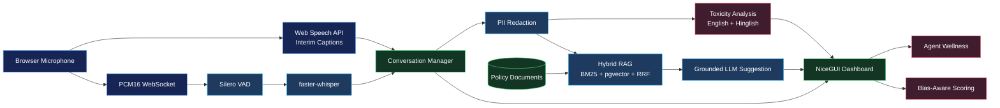

<div align="center">


# AgentShield

**Enterprise AI co-pilot for call center operators.**

[](https://www.python.org)
[](https://fastapi.tiangolo.com)
[](https://nicegui.io)
[](https://github.com/pgvector/pgvector)
[](https://redis.io)
[](https://www.docker.com)
[](#-project-status)
[](LICENSE)

</div>

---

## ⚡ TL;DR

> AgentShield streams live call audio, transcribes speech with `faster-whisper`, retrieves policy-grounded answers through hybrid RAG, detects English and Hinglish toxicity, and tracks operator wellness during a shift.

> [!WARNING]
> AgentShield is pre-production software. Authentication, authorization, distributed session ownership, and model validation must be hardened before processing real customer data.

---

## ✨ Core Capabilities

- **Live call transcription** — Browser captions plus backend `faster-whisper` transcription.
- **PCM WebSocket streaming** — Direct browser microphone audio streamed to FastAPI.
- **Voice activity detection** — Silero VAD filters silence before STT inference.
- **Hybrid RAG** — BM25 keyword retrieval plus `pgvector` semantic search fused with Reciprocal Rank Fusion.
- **Grounded suggestions** — Returns `No KB match found` when indexed policy does not support an answer.
- **PII redaction** — Strips PAN, Aadhaar, credit card, phone, and bank account identifiers before LLM processing.
- **English + Hinglish toxicity detection** — Flags abuse, threats, fraud accusations, frustration, and service-quality complaints.
- **Bias-aware scoring** — Weights aggressive calls at `0.5×` when computing agent performance metrics.
- **Wellness tracking** — Redis-backed shift state for toxic-call exposure and break recommendations.
- **NiceGUI dashboard** — Operator UI for transcript, suggestions, toxicity alerts, wellness status, and knowledge search.

---

## 🧭 Architecture



---

## 🧱 Tech Stack

| Layer | Technology | Role |
|---|---|---|
| API | FastAPI, Uvicorn | ASGI service, REST endpoints, WebSocket streaming |
| UI | NiceGUI | Python-based live operator dashboard |
| Database | PostgreSQL 16, pgvector | Relational storage and vector search |
| Session state | Redis | Conversation and wellness state |
| ORM | SQLAlchemy | Models, sessions, and persistence helpers |
| Retrieval | rank-bm25, pgvector, RRF | Hybrid keyword and semantic retrieval |
| Embeddings | `all-MiniLM-L6-v2` | 384-dimensional local embeddings |
| LLM | OpenAI SDK or Groq SDK | Grounded response generation |
| STT | faster-whisper | Server-side transcription via CTranslate2 |
| VAD | Silero VAD | Speech segment detection |
| Audio | PCM16, FFmpeg | Browser streaming and encoded audio normalization |
| TTS | edge-tts | MP3 response audio generation |
| Runtime | Python 3.11 | Application language |
| Local infra | Docker Compose | PostgreSQL + pgvector development stack |

---

## 🗂️ Project Structure

```text
AgentShield/
|-- main.py                         # Starts API and dashboard together
|-- start-dashboard.ps1             # Windows launcher for local dashboard use
|-- requirements.txt
|-- evals_requirements.txt
|-- Dockerfile
|-- docker-compose.yml
|-- config/
|   |-- settings.py                 # Environment-driven configuration
|   `-- logger.py
|-- src/
|   |-- api/                        # FastAPI app, routes, rate limiting
|   |-- analysis/                   # PII, toxicity, wellness logic
|   |-- audio/                      # STT, VAD, TTS, audio normalization
|   |-- core/                       # DB models/connections and session orchestration
|   |-- ingestion/                  # Document parsing and indexing
|   `-- retrieval/                  # Hybrid retrieval, query building, generation
|-- ui/
|   `-- app.py                      # NiceGUI live dashboard
|-- evaluation/
|   |-- golden_dataset.jsonl        # Golden retrieval examples
|   |-- out_of_scope_dataset.jsonl  # OOS + in-scope control questions for grounding eval
|   |-- metrics.py                  # Deterministic retrieval metrics
|   |-- rag_pipelines.py            # Evaluation pipeline adapters
|   |-- runner.py                   # LangSmith experiment runner
|   |-- faithfulness.py             # Hallucination / faithfulness evaluator (LLM-as-judge)
|   |-- grounding.py                # Grounding bypass evaluator
|   |-- pii_eval.py                 # PII redaction coverage evaluator
|   `-- eval_suite.py               # Unified CI runner (all three evaluators)
|-- infra/
|   `-- scripts/                    # Infrastructure helper scripts
`-- data/
    |-- knowledge_base/             # Policy and support documents
    `-- audio_out/                  # Generated TTS audio files
```

---

## ⚙️ Quickstart

<details>
<summary><strong>Expand local setup instructions</strong></summary>
<br/>

### 1. Clone and create a virtual environment

```powershell
git clone https://github.com/laveshjadon/agentshield.git
cd AgentShield
python -m venv venv
.\venv\Scripts\activate
```

### 2. Install dependencies

```powershell
pip install --upgrade pip
pip install -r requirements.txt
```

If optional runtime packages are missing:

```powershell
pip install edge-tts
pip install torch torchaudio --index-url https://download.pytorch.org/whl/cpu
```

### 3. Configure environment

```powershell
Copy-Item .env.example .env
```

Edit `.env` with your database, Redis, and LLM provider credentials.

### 4. Start PostgreSQL

```powershell
docker compose up -d db
```

### 5. Initialize the schema

```powershell
python -m src.core.db
```

### 6. Add knowledge files

Place supported documents in `data/knowledge_base/`. Supported formats: `.txt` `.md` `.pdf` `.docx` `.html`

### 7. Index the knowledge base

```powershell
python -m src.ingestion.indexer
```

### 8. Run AgentShield

```powershell
python main.py
```

### 9. Open local services

| Service | URL |
|---|---|
| Dashboard | `http://localhost:8081` |
| API docs | `http://localhost:8080/docs` |
| Health check | `http://localhost:8080/health` |

</details>

---

## 🔌 API Reference

Interactive OpenAPI docs: `http://localhost:8080/docs`

### Health & Status

| Method | Endpoint | Purpose |
|---|---|---|
| `GET` | `/` or `/api/info` | Service status |
| `GET` | `/health` | API and database connectivity check |
| `POST` | `/api/analysis/toxicity` | Analyze text for toxicity |

### Calls

| Method | Endpoint | Purpose |
|---|---|---|
| `POST` | `/api/calls/start` | Start a call session, return `session_id` |
| `POST` | `/api/calls/analyse-text` | Analyze a transcript turn, return suggestion |
| `POST` | `/api/calls/transcribe-audio/{session_id}` | Upload audio for transcription |
| `GET` | `/api/calls/session/{session_id}` | Return current session transcript |
| `GET` | `/api/calls/active` | List active sessions |
| `POST` | `/api/calls/end/{session_id}` | End session, persist summaries |
| `GET` | `/api/calls/agent/{agent_id}/performance` | Return bias-adjusted performance metrics |
| `WS` | `/api/calls/ws/audio/{session_id}` | Stream PCM audio for live transcription |

> [!NOTE]
> `POST /api/calls/end/{session_id}` requires `agent_id` as a query parameter.
>
> ```
> POST /api/calls/end/a1b2c3d4e5?agent_id=agent_001
> ```

### Knowledge Base

| Method | Endpoint | Purpose |
|---|---|---|
| `POST` | `/api/knowledge/upload` | Upload and index a knowledge document |
| `POST` | `/api/knowledge/search` | Search indexed knowledge chunks |
| `GET` | `/api/knowledge/documents` | List uploaded documents |

### Wellness

| Method | Endpoint | Purpose |
|---|---|---|
| `GET` | `/api/wellness/{agent_id}/status` | Current wellness status |
| `POST` | `/api/wellness/{agent_id}/break` | Log a break |
| `GET` | `/api/wellness/{agent_id}/report` | Shift report |
| `GET` | `/api/wellness/` | List tracked agents |

---

## 🛡️ Toxicity Detection

Two-pass detection designed for live-call latency constraints.

**Pass 1 — Keyword + regex scan (fast)**

| Category | Examples |
|---|---|
| Frustration | `pareshan`, `koi help nahi`, `bahut problem` |
| Complaint | `complaint karunga`, `service kharab` |
| Fraud / threat | `fraud company`, `police mein report` |
| Abuse | English and Hinglish abuse patterns |

**Pass 2 — LLM scoring (only when keyword score > 0.2)**

Output: `score`, `level`, `flags`, `is_toxic`, `alert_message`

**Score thresholds**

| Range | Level | Meaning |
|---|---|---|
| `< 0.25` | `safe` | No action |
| `0.25 – 0.49` | `warning` | Frustration or early hostility |
| `0.50 – 0.74` | `danger` | Hostile language |
| `≥ 0.75` | `critical` | Abusive or threatening language |

---

## ❤️ Agent Wellness Tracking

Tracks toxic-call exposure across a full shift, not per-call.

| Event | Wellness delta |
|---|---|
| Safe call | `+5` |
| Warning call | `−3` |
| Danger call | `−10` |
| Critical call | `−20` |
| Call > 5 min (toxic) | penalty `× 1.5` |
| 3+ consecutive toxic | penalty `× 1.25` |
| Break | `+2 per minute`, capped at `+40` |

**Break recommended when:** score `< 30`, stress level `critical`, or 3+ consecutive toxic calls.

---

## ⚖️ Bias-Aware Performance Scoring

Aggressive calls are weighted at `0.5×` to avoid penalizing agents for caller behavior they cannot control.

```
adjusted = (clean_avg × clean_count + aggressive_avg × 0.5 × agg_count)
           / (clean_count + 0.5 × agg_count)
```

**Example**

| Metric | Value |
|---|---|
| Clean calls | 8 @ avg 90 |
| Aggressive calls | 4 @ avg 70 |
| Raw average | 83.33 |
| **Adjusted average** | **86.00** |

---

## 📊 Evaluation Pipeline

AgentShield ships a full evaluation harness covering retrieval quality, hallucination, grounding, and PII redaction.

### Retrieval Metrics

#### 1. Install evaluation dependencies

```powershell
pip install -r evals_requirements.txt
```

#### 2. Configure environment variables

```powershell
$env:OPENAI_API_KEY="sk-..."
$env:LANGCHAIN_API_KEY="lsv2_..."
$env:LANGCHAIN_TRACING_V2="true"
$env:LANGCHAIN_PROJECT="agentshield-hybrid-rag-eval"
```

#### 3. Prepare the golden dataset

Golden examples live in `evaluation/golden_dataset.jsonl`. Each row requires `id`, `question`, `ground_truth`, and `ground_truth_context`.

```json
{
  "id": "refund_window",
  "question": "How long does a customer have to request a refund?",
  "ground_truth": "Customers can request a refund within the refund window described in the refund policy.",
  "ground_truth_context": ["refund_policy.txt"],
  "metadata": {"topic": "refunds"}
}
```

#### 4. Run retrieval metrics

```powershell
python -m evaluation.runner --pipeline mock
python -m evaluation.runner --pipeline hybrid
python -m evaluation.runner --pipeline baseline
```

Calculates and logs `recall@1/3/5`, `hit@1/3/5`, and `mrr@1/3/5` as LangSmith feedback scores. After the latest tuning, the hybrid retriever reaches `1.000` for `recall@1`, `hit@1`, and `mrr@1` on the included golden set.

---

### Generation Quality & Safety Evaluators

Three evaluators cover hallucination, grounding, and PII redaction:

| Evaluator | File | What it measures | Pass gate |
|---|---|---|---|
| **Faithfulness** | `evaluation/faithfulness.py` | Are all claims in a suggestion supported by the retrieved context? (LLM-as-judge) | Mean faithfulness ≥ 0.95 |
| **Grounding bypass** | `evaluation/grounding.py` | Does the system refuse out-of-scope questions instead of hallucinating? | Bypass rate < 5%, over-refusal rate < 10% |
| **PII coverage** | `evaluation/pii_eval.py` | Does PIIService catch every entity type without over-redacting clean tokens? | FNR < 5% per entity type, zero false-positive failures |

#### Run the unified suite

```powershell
# All three evaluators, mock pipelines — no API keys required
python -m evaluation.eval_suite --pipeline mock

# Against the live hybrid pipeline
python -m evaluation.eval_suite --pipeline hybrid

# Skip one evaluator
python -m evaluation.eval_suite --pipeline hybrid --skip pii
```

#### Run a single evaluator

```powershell
python -m evaluation.faithfulness --pipeline hybrid
python -m evaluation.grounding --pipeline mock
python -m evaluation.pii_eval --verbose
```

The out-of-scope test dataset for grounding is `evaluation/out_of_scope_dataset.jsonl` (14 OOS + 3 in-scope control questions). Add rows there to extend coverage.

The unified runner exits with code `0` on full pass and `1` on any failure, making it suitable as a CI gate.

---

### Plug In Your Production Pipeline

Edit `evaluation/rag_pipelines.py`. Your pipeline must return:

```python
{
    "answer": "final generated answer",
    "contexts": [
        {
            "source_file": "refund_policy.txt",
            "chunk_index": 0,
            "content": "retrieved chunk text",
        }
    ],
    "metadata": {"pipeline": "hybrid"},
}
```

---

## 📌 Project Status

> [!NOTE]
> The core local pipeline is implemented and functional. The items below are known hardening requirements before any production deployment.

- [ ] Add authentication and authorization.
- [ ] Replace permissive CORS defaults with deployment-specific origins.
- [ ] Move in-process `ConversationManager` to shared infrastructure for horizontal scaling.
- [ ] Profile synchronous retrieval and model operations under realistic concurrency.
- [ ] Validate Hinglish toxicity thresholds against a labeled dataset.
- [ ] Validate bias-aware scoring against real quality-review data.
- [ ] Replace `fakeredis` and local BM25 fallbacks with durable production services.
- [ ] Add secure WebSocket deployment behind an API gateway or reverse proxy with `wss://`.

---

## 📝 Environment Variables

<details>
<summary><strong>Expand environment reference</strong></summary>
<br/>

| Variable | Required | Purpose |
|---|---|---|
| `POSTGRES_USER` | Yes | PostgreSQL username |
| `POSTGRES_PASSWORD` | Yes | PostgreSQL password |
| `POSTGRES_DB` | Yes | PostgreSQL database name |
| `POSTGRES_HOST` | Yes | `localhost` locally, `db` inside Docker Compose |
| `POSTGRES_PORT` | Yes | Database port |
| `REDIS_URL` | Yes | Redis connection URL |
| `REDIS_ALLOW_FAKE` | No | Set `1` for local dev without a Redis instance |
| `LLM_PROVIDER` | Yes | `openai` or `groq` |
| `LLM_MODEL` | Yes | Chat model name passed to the provider |
| `GROQ_API_KEY` | For Groq | Groq API key |
| `OPENAI_API_KEY` | For OpenAI | OpenAI API key |
| `WHISPER_MODEL` | Yes | `base`, `small`, or `medium` |
| `WHISPER_DEVICE` | Yes | `cpu` or `cuda` |
| `EMBEDDING_MODEL` | Yes | Sentence-transformers model name |
| `RAG_CHUNK_SIZE` | Yes | Character chunk size for document splitting |
| `RAG_CHUNK_OVERLAP` | Yes | Character overlap between chunks |
| `RAG_TOP_K` | Yes | Number of chunks returned by retrieval |
| `APP_HOST` | Yes | API bind host |
| `APP_PORT` | Yes | API bind port |
| `LOG_LEVEL` | Yes | Application logging level |
| `CORS_ORIGINS` | Yes | Comma-separated allowed browser origins |

</details>

> [!WARNING]
> Never commit `.env`, API keys, customer transcripts, or production knowledge-base documents to version control.

---

## 🗺️ Roadmap

### Phase 1 — Indic Language Expansion
- [ ] Evaluate Indic STT models (AI4Bharat, Bhashini) for Hindi, Tamil, Telugu, Bengali.
- [ ] Upgrade embeddings to a multilingual model (MuRIL or IndicBERT) for cross-lingual retrieval.
- [ ] Add dashboard language selectors for Web Speech API and native script UI.

### Phase 2 — Local Model Optimization
- [ ] Evaluate Indic-aware tokenizers for RAG chunking.
- [ ] Test local SLM serving with `vLLM` (Llama-3-Indic, OpenHathi).
- [ ] Benchmark quality, latency, and cost before migrating from external APIs.

### Phase 3 — Human Feedback Loop
- [ ] Add positive/negative feedback controls to dashboard suggestions.
- [ ] Store feedback with redacted transcript, context, selected response, and model version.
- [ ] Build offline quality, safety, and regression evaluation gates.
- [ ] Explore DPO fine-tuning from reviewed preference pairs.

### Phase 4 — Enterprise Deployment
- [ ] Move STT and local model inference to GPU compute (AWS G4dn or G5).
- [ ] Migrate PostgreSQL/pgvector to managed RDS and Redis to ElastiCache.
- [ ] Add JWT authentication, authorization, and secret management.
- [ ] Enable `wss://` behind Nginx or an API gateway.
- [ ] Support distributed WebSocket sessions across application instances.

---

## 🤝 Contributing

Issues and pull requests are welcome. Keep changes scoped, tested, and aligned with the existing architecture.

---

## 📄 License

Released under the [MIT License](LICENSE).
